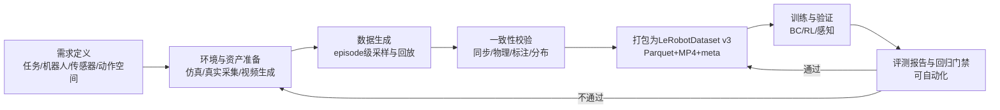
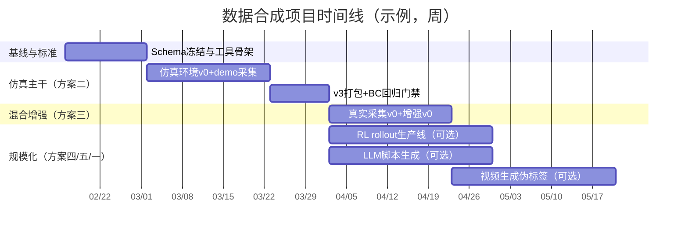
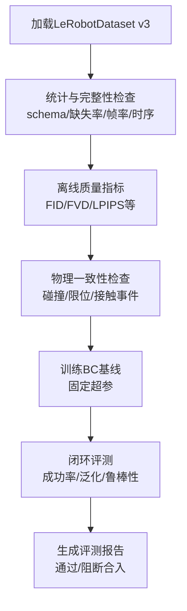

# 基于LeRobot的具身智能高质量合成数据项目可行方案研究报告

## 执行摘要

本报告围绕“以LeRobot为数据标准与训练入口，合成可用于具身智能（尤其是机械臂）高质量训练数据”的目标，给出一套统一的数据规格与评测基线，并按“思路—交付数据内容—实现路径—合成数据量目标—评测”的结构提出五条可行方案（含你已提出的两条初步想法并加以完善），并给出优先级与推荐实施顺序。核心结论是：**优先用“仿真可控、动作可得、标注可真”的路径拿到第一版高一致性数据，再用“真实采集+合成增强”缩小Sim2Real差距，最后再引入“强化学习/大模型脚本/视频生成”扩展规模与多样性**。这一顺序的原因在于：LeRobotDataset v3强调多模态时序数据的可扩展存储（Parquet+MP4/图像、结构化元数据、任务文本、可流式训练），更适合先落地一条端到端“生成—校验—打包—训练—回归”的闭环流水线，再逐步替换/叠加更激进的数据来源。citeturn1view2turn10view0turn1view1

在数据标准层面，本报告建议以LeRobotDataset v3为“事实标准”：以Parquet承载逐帧状态/动作/时间戳等低维信号，以MP4承载相机流，以`meta/info.json`与`meta/episodes/*`等元数据实现跨episode的切片与高效加载，并利用其“流式加载/大规模分片/任务文本映射”能力支撑规模化合成与训练。citeturn10view0turn1view1turn1view2

在评测层面，本报告给出离线质量指标（视频质量、物理一致性、动作-视觉同步、动作多样性、标签准确率）与下游任务评估（行为克隆/强化学习/感知模块），并提供可自动化的基准测试流程与示例脚本骨架，优先选用社区常用指标（如FID、FVD、LPIPS）并补充具身数据特有的一致性检查。citeturn7search9turn7search0turn7search3

## 背景与问题定义

LeRobot是由 entity["company","Hugging Face","ai platform company"] 推动的端到端机器人学习开源体系，目标是提供模型、数据集与工具，降低真实机器人学习门槛，并给出统一的硬件接口与标准化数据集格式（LeRobotDataset，支持Parquet+MP4/图像、可视化与流式训练）。citeturn1view2turn0search5turn10view0

LeRobotDataset的设计要点与本项目高度相关：它面向机器人时序数据的复杂性（多相机、多传感器、动作/状态高频、episode组织、任务语言等），明确将数据分为“表格低维信号、视觉数据、元数据”三部分，并在v3中强化“将多episode合并为大文件+元数据切片”的可扩展结构，从而支撑数百万episode规模的数据集与流式训练。citeturn1view3turn10view0turn1view1

本项目的关键难点不在“能否生成数据”，而在“**能否生成可训练、可复现、可评测且可逐步扩展的数据**”。为避免合成数据“看起来很真但学不到控制规律”的常见陷阱，报告建议将问题拆为五个工程闭环：

1) **动作—视觉—状态的时序同步**（timestamp、帧率、控制频率、相机延迟）；2) **动作语义可解释**（关节/末端/夹爪等动作空间统一）；3) **物理一致性可验证**（碰撞、穿模、接触、动力学可行性）；4) **分布可控与多样性可量化**（任务、场景、物体、光照、干扰）；5) **下游可回归**（BC/RL、成功率、泛化）。这些目标与LeRobotDataset提供的任务元数据与跨模态组织方式高度匹配。citeturn10view0turn10view4turn6view0

未指定信息（需在立项时补齐，否则将影响估算精度）：目标机器人本体/动作空间、任务集合与成功判据、期望传感器套件（RGBD/力矩/触觉/IMU等）、目标数据规模与算力预算、是否需要公开发布与合规约束（素材版权/人像/许可）。本报告将对每个方案逐项标注“未指定”。citeturn12view4turn10view0

## 数据规范与基线设计

### 统一数据规格

建议将所有方案的最终交付统一落在LeRobotDataset v3（或与其字段约定一致的兼容子集）上：  
- **表格数据（Parquet）**：逐帧存储`observation.state`、`action`、`timestamp`等；  
- **视觉数据（MP4/图像）**：按相机key分片存储；  
- **元数据（info/tasks/episodes/stats）**：声明schema、帧率、归一化统计、episode切片信息与任务文本映射。citeturn10view0turn1view1turn1view2

尤其建议直接复用LeRobot文档中展示的“标准字段”与“可扩展字段”的路径，例如在DROID搬运示例中同时保留：`observation.state.*`、`action.*`与合并后的`observation.state`、`action`，并包含episode标记与语言指令字段。citeturn10view4turn1view1

下面给出一个“最小可训练子集（MVP Schema）”，后续方案在此基础上增量扩展：

| 字段路径（Parquet列名） | 类型/形状（示例） | 含义 | 必需性 |
|---|---:|---|---|
| `is_first` / `is_last` / `is_terminal` | bool (1,) | episode边界/终止标记 | 建议必需 citeturn10view4 |
| `timestamp` | float32 (1,) | 逐帧时间戳（秒） | 必需 citeturn10view0 |
| `observation.state` | float32 (N,) | 统一的低维状态向量（关节+夹爪等） | 必需 citeturn10view4turn1view3 |
| `action` | float32 (N,) | 与`observation.state`对齐的统一动作向量 | 必需 citeturn10view4 |
| `observation.images.<cam>` | 图像/视频帧 | 相机流（MP4或逐帧图像） | 强烈建议 citeturn10view0turn1view3 |
| `language_instruction` | string (1,) | 任务文本（可选但强烈建议） | 建议 citeturn10view4turn10view0 |

工程注意事项（会直接影响“数据能否被训练代码正确加载”）：  
- v3写入模式强调写完必须`finalize()`，否则Parquet文件可能不完整导致无法加载；同时v3通过合并分片与episodes元数据实现规模化。citeturn10view3turn1view1  
- 大规模处理/搬运可参考LeRobot官方“SLURM并行porting”思路（分worker处理、聚合、再上传），便于你后续把合成任务本身也做成分布式作业。citeturn1view1

### 端到端流水线基线

建议把“合成数据”也当作一个可回归的ML产品：每次数据生成都必须能复现（版本化配置、随机种子、资产hash、代码commit），并通过自动评测产出一份固定格式的report（质量指标+下游成功率+数据分布）再决定是否进入训练集主分支。LeRobot同时支持从Hub加载数据集与仿真环境（EnvHub），有利于把“环境—数据—训练—评测”做成一条可共享/可复现的链路。citeturn6view1turn6view0turn10view0



上述闭环的关键在于“校验门禁”：没有校验的合成数据很容易出现**视觉很好但动作不可学**或**动作很好但视觉与动作不同步**的问题；v3格式在schema与元数据层面为这种门禁提供了落点。citeturn10view0turn10view4turn12view4

## 可行方案集

### 方案一 单帧到视频生成再到IDM动作序列

#### 思路

从单帧图像（或少量关键帧）出发，用图像到视频生成模型合成一段“看似连贯”的操作视频，再用逆动力学模型（IDM，给定前后观测预测动作）把视频转成动作序列，最终落盘为LeRobotDataset可训练的“视觉+动作”轨迹。其本质是“用视频模型补齐状态演化，用IDM补齐动作标签”，与“用IDM从无动作视频生成伪动作标签”的思路一致。citeturn4search0turn5search13turn5search17

该路径的优势是：**对真实机器人与仿真资产依赖小、启动快、可用互联网/合成图像扩充视觉分布**；主要风险是：视频生成模型不保证严格物理一致性与可控性，导致IDM输出动作与真实控制规律偏离。citeturn4search1turn7search16turn5search2

**关键假设与前提**

| 项目 | 状态 | 说明 |
|---|---|---|
| 目标机器人与动作空间定义 | 未指定 | 必须先定：关节位置/速度/增量、夹爪开合等（决定`action`语义）。citeturn10view4 |
| 单帧来源与覆盖范围 | 未指定 | 可来自真实采集、仿真渲染、或程序化生成；分布决定可学性。 |
| 可用的IDM训练数据 | 未指定 | 若无高质量少量标注数据，IDM易崩；可先在仿真中训练IDM再迁移。citeturn5search3turn5search17 |
| 视频生成模型可用性/算力 | 未指定 | 需GPU推理；模型选择影响时间一致性与失真率。citeturn4search0turn4search17 |

**所需输入与资源（建议）**

| 资源类型 | 建议配置 |
|---|---|
| 硬件 | 至少1–4张GPU用于视频生成与IDM训练/推理（未指定具体型号）。 |
| 软件 | LeRobot（数据打包/加载/训练）、视频生成框架（可用Stable Video Diffusion路线）、训练框架（PyTorch）。citeturn10view0turn4search0turn4search17 |
| 数据 | （a）单帧/关键帧池；（b）少量带动作的真实或仿真轨迹用于IDM监督；（c）任务文本模板（可选）。citeturn10view4turn10view0 |
| 模型 | 图像到视频扩散模型（如SVD类）、IDM或端到端PIDM/Seer类模型（可选）。citeturn4search0turn5search17turn5search6 |

#### 交付数据内容

最终交付为LeRobotDataset v3兼容数据集：Parquet逐帧+MP4相机流+meta。citeturn10view0turn1view2

| 模态 | 字段路径示例 | 备注 |
|---|---|---|
| 视频 | `observation.images.front`（MP4） | 由图像到视频模型生成；建议同时保存生成参数/种子到`meta`或额外列。citeturn10view0turn4search0 |
| 动作序列 | `action`（float32, N） | 由IDM从相邻帧推断；建议保存`action_confidence`（可选）。citeturn5search13turn5search3 |
| 状态（可选但强烈建议） | `observation.state` | 若无法从单帧得到真实状态，可采用“视觉状态估计/关键点/潜变量”替代，但需在schema中显式声明。citeturn10view0turn5search17 |
| 任务文本（建议） | `language_instruction` | 可由模板/LLM生成并做一致性过滤。citeturn10view4turn7search2 |
| 同步 | `timestamp` + `is_first/is_last` | 必须按episode组织并可复现切片。citeturn10view4turn10view0 |

#### 实现路径

建议把该方案定位为“后期视觉分布扩增器”，而非第一条主数据来源。一个可落地的MVP实现顺序如下（按工程周估算，未指定团队规模时默认2–3人小组）：

| 步骤 | 产出 | 时间估计 |
|---|---|---|
| 定义动作空间与相机规范（分辨率/FPS/视角） | schema v0 | 3–5天 citeturn10view0turn10view4 |
| 获取少量带动作轨迹训练/校准IDM（优先仿真） | IDM v0 + 校准报告 | 1–2周 citeturn5search3turn6view0 |
| 单帧→视频批量生成（带参数记录） | 原始生成视频池 | 1–2周 citeturn4search0turn4search17 |
| 视频→动作（IDM推断）+过滤（物理/时序/异常） | 伪标签轨迹池 | 1周 citeturn5search13turn7search16 |
| 打包为LeRobotDataset v3（finalize+统计） | 数据集v0（Hub/本地） | 2–4天 citeturn10view3turn10view0 |
| 训练BC基线并回归 | MVP可用性结论 | 3–5天 citeturn1view3turn6view0 |

**自动化流水线与工具链建议**：  
- 生成与推断作业建议容器化+配置化（Hydra/纯YAML皆可），视频生成与IDM推断分开队列；  
- 大规模版本建议采用“分片写入+聚合+上传”的模式，思路可参考LeRobot官方对大数据集porting的SLURM并行流程（即便你的数据不是“搬运”，也能复用其分布式分工范式）。citeturn1view1turn10view0  

**潜在风险与缓解措施（摘要）**

| 风险 | 影响 | 缓解 |
|---|---|---|
| 视频物理不一致（穿模/瞬移/接触错误） | IDM学到错误因果 | 加入物理一致性过滤；优先用仿真生成“可控视频”训练IDM；对生成视频做FVD+时序异常检测。citeturn7search16turn5search3turn7search0 |
| IDM泛化差/伪标签噪声大 | BC训练退化 | 采用置信度阈值与自训练迭代；引入PIDM类闭环方法或多模型一致性筛选。citeturn5search17turn5search2 |
| 状态缺失导致不可控 | 只能学到“像”而非“控” | 至少引入可解释视觉状态（关键点/位姿）或限定任务到“纯视觉控制可学”的范围。citeturn5search17 |

#### 合成数据量目标

建议按“三阶段”推进（episode为主计量，视频帧与步数由FPS与控制频率决定；具体FPS未指定）：

| 阶段 | 训练/验证/测试（按episode） | 目标用途 |
|---|---:|---|
| MVP | 2,000 / 200 / 200 | 验证“能否学到基本闭环控制”与过滤策略有效性 |
| 扩展 | 20,000 / 2,000 / 2,000 | 扩充场景与物体组合，观察泛化曲线 |
| 规模化 | 200,000+ / 10,000 / 10,000 | 作为视觉分布增强，与仿真/真实数据混训 |

拆分建议：测试集必须包含“未出现过的背景/光照/物体材质组合”，否则无法衡量生成数据的真实贡献。citeturn12view4turn7search0

#### 评测

该方案评测重点应放在“伪标签可靠性”与“动作-视觉同步”。除通用视频指标外，必须加入下游BC的闭环成功率作为硬约束门槛。citeturn7search0turn5search13turn6view0

**优先级建议：中低（建议第4–5顺位引入）**。理由：其数据规模扩展性强，但物理一致性与动作可控性风险高，更适合在已有“可靠动作数据源”后作为补充。citeturn7search16turn5search2

---

### 方案二 LeRobot机械臂3D建模与仿真生成视频动作序列

#### 思路

围绕目标机械臂建立3D/动力学模型（URDF/MJCF/资产），在仿真平台中生成“可控、可重复、可验证”的操作轨迹，并直接输出同步的视频流与真实动作序列，再打包为LeRobotDataset v3。这是最贴合LeRobot生态的“主干方案”，因为LeRobot不仅支持标准化数据格式，还支持从Hub加载仿真环境（EnvHub）以及与LeIsaac等仿真任务闭环集成（仿真遥操作、采集demo、训练策略）。citeturn6view0turn6view1turn10view0

仿真平台可选：  
- 若追求多模态传感器、照片级渲染与合成标注：可用Isaac Sim的Replicator/SDG工具链（域随机化、传感器模拟、annotators/writers）。citeturn12view0turn12view4turn12view1  
- 若追求轻量与快速物理迭代：可用MuJoCo或PyBullet（支持URDF/MJCF、动力学/逆解/碰撞等）。citeturn2search7turn13view0turn2search3  
- 若考虑Isaac Gym：需注意其已被 entity["company","NVIDIA","gpu computing company"] 标注为legacy/deprecated，更推荐迁移到Isaac Lab。citeturn11view0turn11view1

**关键假设与前提**

| 项目 | 状态 | 说明 |
|---|---|---|
| 目标机械臂型号与URDF/MJCF可得性 | 未指定 | 决定建模工作量与动力学可信度。citeturn2search23turn11view0 |
| 控制接口（关节/末端/力控） | 未指定 | 影响`action`语义与训练算法选择。 |
| 任务集合与成功判据 | 未指定 | 建议从“拾取/放置/推拉/开合”等可程序化判定任务起步。citeturn6view0turn9search0 |
| 视觉规格与传感器套件 | 未指定 | 决定渲染成本与数据字段。citeturn1view3turn12view4 |

**所需输入与资源（建议）**

| 资源类型 | 建议配置 |
|---|---|
| 硬件 | 本地GPU或云GPU（用于渲染/并行仿真）；若使用Isaac Sim/Isaac Lab，GPU更关键。citeturn11view1turn12view4 |
| 软件 | 任选仿真主引擎（Isaac Sim/Isaac Lab 或 MuJoCo/PyBullet），LeRobot数据打包/加载工具链。citeturn10view0turn11view1turn13view0 |
| 资产 | 机械臂模型、夹爪模型、交互物体CAD/材质、场景资产；若用Replicator可复用SimReady资产与标注工具。citeturn12view2turn12view4 |
| 数据 | 少量遥操作demo（可选，用于对齐真实操作风格），或脚本/规划器生成的轨迹。citeturn6view0turn9search0 |

#### 交付数据内容

| 模态 | 字段路径示例 | 备注 |
|---|---|---|
| 多视角视频（建议） | `observation.images.wrist` / `observation.images.front` | 参考LeRobotDataset对多相机的组织方式（按camera key分片MP4）。citeturn1view3turn10view0 |
| 状态 | `observation.state` + 可分解字段（如`observation.state.joint_position`） | 可参照DROID schema拆分再汇总。citeturn10view4 |
| 动作 | `action` + 可分解字段（如`action.joint_position`） | 直接来自仿真控制器输出/记录。citeturn10view4 |
| 任务语言 | `language_instruction`（或tasks映射） | v3支持任务文本映射到ID。citeturn10view0 |
| 物理/事件标注（可选） | `contact_events` / `success` / `failure_reason` | Isaac Sim SDG支持“事件/动作数据生成”范式；也可在仿真侧自定义记录。citeturn12view2turn12view1 |
| 视觉真值标注（可选） | `depth` / `segmentation` / `bbox` / `pose` | Replicator强调annotators/writers与传感器模拟；适合生成“100%准确标注”的感知数据。citeturn12view0turn12view4 |

#### 实现路径

推荐采用“先可用、后逼真”的增量工程法：先用轻量物理引擎把动作与接触逻辑跑通，再逐步换成高保真渲染与多传感器。

| 步骤 | 产出 | 时间估计 |
|---|---|---|
| 建模与导入（机器人+夹爪+基础工位） | 可运行的仿真场景v0 | 1–2周（取决于模型完备度，未指定）citeturn2search23turn11view0 |
| 任务脚本/遥操作采集（先做2–4个任务） | demo采集工具+episode记录 | 1–2周 citeturn6view0turn9search0 |
| 域随机化与传感器扩展（光照/材质/摄像机扰动等） | 多样化生成配置 | 1–2周 citeturn12view4turn12view0 |
| 导出与打包LeRobotDataset v3（含finalize/统计） | 数据集v1 | 3–5天 citeturn10view3turn10view0 |
| 训练BC基线/回归环境成功率 | 训练曲线+门禁阈值 | 3–7天 citeturn1view3turn6view0 |

**自动化流水线与工具链建议**：  
- 若采用Isaac Sim：优先利用Replicator的“合成数据生成+域随机化+传感器模拟+annotators/writers”的标准组件，把标签生成从脚本劳动中解耦。citeturn12view0turn12view4  
- 若采用Isaac Lab用于并行训练/采样：其定位为Isaac Gym的继任者，强调GPU并行物理、渲染、多频传感器模拟与数据采集管线，适合规模化rollout。citeturn11view1turn2search36  
- 环境分发建议做成EnvHub包：LeRobot允许从Hub一行代码加载环境，但需注意`trust_remote_code`安全提示与版本pin（commit hash）。citeturn6view1turn6view0

**潜在风险与缓解措施（摘要）**

| 风险 | 影响 | 缓解 |
|---|---|---|
| 模型/控制与真实差距（动力学、摩擦、传感器噪声） | Sim2Real失败 | 使用域随机化同时覆盖appearance/content gap；逐步引入真实校准数据。citeturn12view4turn12view0 |
| 资产/场景多样性不足 | 泛化差 | 引入程序化场景/资产生成（如Infinigen系）或资产库扩充；优先覆盖长尾组合。citeturn3search3turn12view0 |
| 生成规模上来后IO瓶颈 | 训练吞吐低 | 采用v3分片+流式加载；按官方建议组织`data/`与`videos/`，并严格`finalize()`。citeturn10view0turn10view3 |

#### 合成数据量目标

该方案通常是最可控、最适合作为“主训练集骨架”的数据源：

| 阶段 | 训练/验证/测试（episode） | 备注 |
|---|---:|---|
| MVP | 5,000 / 500 / 500 | 覆盖2–4个任务、2个相机视角；验证数据格式、同步与训练闭环。citeturn10view0turn6view0 |
| 扩展 | 50,000 / 5,000 / 5,000 | 引入域随机化与更多物体/场景；开始做“跨场景hold-out测试”。citeturn12view4turn12view0 |
| 规模化 | 500,000+ / 20,000 / 20,000 | 多任务+多传感器（RGBD/分割/深度等），并行rollout与流式训练配套。citeturn10view0turn11view1 |

#### 评测

除通用指标外，重点评测：  
- **物理一致性**（穿模率、非法接触、关节限位违规、接触事件与视觉一致性）；  
- **Sim2Real潜力**（域随机化覆盖度、对真实少量数据微调增益）。  
Replicator文档明确把“域随机化、传感器模拟、annotators/writers”作为机器人SDG核心能力，并特别讨论appearance/content gap；这为你的评测维度提供了理论框架。citeturn12view4turn12view0

**优先级建议：最高（建议第1顺位主干落地）**。理由：动作与标注“真值可得”、可控可复现、与LeRobot/EnvHub/LeIsaac生态天然契合。citeturn6view0turn6view1turn10view0

---

### 方案三 真实采集与合成混合增强

#### 思路

以真实遥操作采集为“分布锚点”，用合成手段扩展视觉与场景分布，形成“真实少量高质量 + 合成大量多样化”的混合训练集。这里的合成不必局限于纯仿真：可以对真实视频做受控增强（光照、背景、风格、遮挡），也可以采用“人类视频→机器人形态迁移”的方式把海量人类第一视角视频转换为机器人视角数据，从而缓解“人手—机械臂外观差距”。citeturn10view0turn14view0turn12view4

H2R工作给出了一个与本方案高度一致的参考路径：检测人手关键点、在仿真中合成机器人运动并渲染到第一视角视频中，从而构造机器人中心的视频预训练数据，并报告在仿真与真实任务上都有提升。citeturn14view0

**关键假设与前提**

| 项目 | 状态 | 说明 |
|---|---|---|
| 可进行真实遥操作采集 | 未指定 | 若可采集，建议先用LeRobot录制工具或其接口生成v3数据。citeturn10view1turn0search11 |
| 真实场景/物体与目标任务 | 未指定 | 决定增强策略（背景替换/风格迁移/遮挡模拟等）。 |
| 合成增强是否允许改变几何关系 | 未指定 | 若改变几何（如大幅形变），需重新校准动作-视觉一致性。 |
| 数据合规与素材许可 | 未指定 | 若引入公开视频，需额外做许可审查（本报告仅从技术可行性分析）。citeturn14view1 |

**所需输入与资源（建议）**

| 资源类型 | 建议配置 |
|---|---|
| 硬件 | 至少1套真实采集硬件（机械臂+相机/夹爪；未指定型号），以及GPU用于增强/渲染。citeturn0search11turn12view4 |
| 软件 | LeRobot录制/打包工具；视觉增强工具链（视频编辑/分割/关键点检测）；可选仿真渲染引擎用于H2R式合成。citeturn10view1turn14view0 |
| 数据 | （a）真实带动作轨迹；（b）可选人类视频数据源；（c）对象/场景资产（用于合成叠加）。citeturn14view0turn10view0 |

#### 交付数据内容

| 数据子集 | 字段路径示例 | 说明 |
|---|---|---|
| 真实原始轨迹 | `observation.*`、`action`、`timestamp` | 作为anchor分布；建议保留原始相机标定信息在meta。citeturn10view0turn1view3 |
| 真实增强轨迹 | 同上 + `augmentation_id`（可选） | 仅做“保持几何一致”的增强（颜色/光照/噪声/轻遮挡），动作可复用。citeturn10view0 |
| 人类视频→机器人形态迁移（可选） | `observation.images.*` + `pseudo_action`（可选） | 可参考H2R：用关键点+仿真渲染替换人手为机械臂，从视觉上贴近机器人。citeturn14view0 |
| 语言/标签（建议） | `language_instruction`、`success`等 | 用于任务条件化与评测分组。citeturn10view4turn1view1 |

#### 实现路径

| 步骤 | 产出 | 时间估计 |
|---|---|---|
| 真实采集MVP（少任务，先闭环） | 真实数据v0 | 1–2周 citeturn10view1turn0search11 |
| 制定“可逆增强”策略并实现 | 增强调度器v0 | 1周 |
| 混合集打包为v3 + 统计与可视化 | 数据集v1 | 3–5天 citeturn10view0turn10view3 |
| 可选：接入H2R式人类视频迁移 | 迁移数据子集v0 | 2–4周（依赖素材与工程）citeturn14view0 |
| 下游训练与对比（真实-only vs 混合） | 增益结论 | 1周 |

**自动化流水线与工具链建议**：  
- 把“增强”做成确定性变换（保存参数、随机种子），确保可复现与可追溯；  
- 对每个增强策略建立A/B门禁：先离线指标不过线就不进入训练集主分支；  
- 若接入H2R式合成，可把“关键点检测—仿真渲染—合成回写”做成可批处理的流水线。citeturn14view0turn12view4  

**潜在风险与缓解措施（摘要）**

| 风险 | 影响 | 缓解 |
|---|---|---|
| 增强破坏动作-视觉一致性 | 训练不稳定 | 只做不改变几何关系的增强；任何几何变换必须同步更新相机参数/标签。 |
| 真实数据量不足 | 仍难泛化 | 用仿真/形态迁移扩大视觉分布；以真实数据做校准与过滤阈值学习。citeturn12view4turn14view0 |
| 数据许可/隐私问题 | 无法发布/复用 | 建立素材来源与许可台账（未指定）。citeturn14view1 |

#### 合成数据量目标

| 阶段 | 训练/验证/测试（episode） | 结构建议 |
|---|---:|---|
| MVP | 1,000真实 + 4,000增强 / 500 / 500 | 验证“增强是否带来BC提升” |
| 扩展 | 5,000真实 + 50,000增强 / 5,000 / 5,000 | 强化跨背景/光照/遮挡 |
| 规模化 | 20,000真实 + 500,000增强 / 20,000 / 20,000 | 作为主训练集与仿真数据混训 |

拆分建议：测试集至少包含“真实新场景/新物体”，并固定不做增强，以防评价被增强策略“污染”。citeturn12view4turn10view0

#### 评测

重点看“混合是否缩小Sim2Real/Real2Real差距”：  
- 真实-only vs 真实+增强 的BC成功率提升；  
- 对新场景/新光照鲁棒性；  
- 若做形态迁移，可参考H2R的“语义一致性相似度”思路（基于CLIP的图文一致性度量）验证合成帧语义是否跑偏。citeturn14view0turn7search2

**优先级建议：高（建议第2顺位）**。理由：以真实数据锚定分布，通常比纯生成更稳健，且能在较小规模就观察到对真实部署的增益。citeturn14view0turn12view4

---

### 方案四 强化学习策略生成与渲染

#### 思路

在仿真中用强化学习训练策略（可多任务/多场景/域随机化），再用训练后的策略进行大规模rollout生成“高成功率/高多样性”的轨迹数据，并渲染为多视角视频与同步动作序列，最终打包为LeRobotDataset。该方案的核心价值是：**无需人工遥操即可持续产出高质量轨迹，并能系统性覆盖长尾初始状态与干扰条件**。citeturn11view1turn12view4turn6view0

Isaac Lab被 entity["company","NVIDIA","gpu computing company"] 定位为Isaac Gym的继任者，强调GPU并行物理、照片级渲染、多频传感器模拟、数据采集管线与域随机化工具，天然适合该方案。citeturn11view1turn11view0

**关键假设与前提**

| 项目 | 状态 | 说明 |
|---|---|---|
| 可定义可学习奖励/成功判据 | 未指定 | RL质量高度依赖奖励设计与终止条件。 |
| 仿真环境可并行化 | 未指定 | 决定数据产量与成本；Isaac Lab倾向GPU并行。citeturn11view1turn11view0 |
| 任务难度与长时序需求 | 未指定 | 长时序任务可能更适合脚本/规划混合（见方案五）。 |

**所需输入与资源（建议）**

| 资源类型 | 建议配置 |
|---|---|
| 硬件 | 多GPU或高端GPU（并行环境+渲染）；未指定规模时建议先从单机多环境起步。citeturn11view1turn11view0 |
| 软件 | Isaac Lab/仿真引擎 + RL库 + LeRobot打包工具；必要时用EnvHub封装环境以复现。citeturn6view1turn11view1 |
| 数据 | 初始任务/资产/随机化配置；可选少量demo用于warm start（IL+RL）。citeturn11view1turn6view0 |

#### 交付数据内容

| 模态 | 字段路径示例 | 说明 |
|---|---|---|
| 视频 | `observation.images.*` | 强烈建议至少“腕相机+外部相机”两视角。citeturn1view3turn10view0 |
| 动作/状态 | `action`、`observation.state` | 来自策略rollout的真实控制信号与状态。 |
| 奖励/成功标注（建议） | `reward`、`success`、`episode_return` | RL数据自带，可用于筛选高质量轨迹与课程学习。citeturn11view1turn6view0 |
| 域随机化参数（建议） | `domain_rand.*`（可选） | 保存关键随机化参数用于分布分析与回放。citeturn12view4turn11view1 |

#### 实现路径

| 步骤 | 产出 | 时间估计 |
|---|---|---|
| 建立可训练的RL环境与reward | env+reward v0 | 1–2周（未指定任务复杂度） |
| RL训练到可用成功率（含并行采样） | policy v0 | 2–6周（强依赖任务）citeturn11view1turn11view0 |
| 策略驱动rollout生成大规模轨迹 | 轨迹池v1 | 1–2周（可并行持续生成） |
| 轨迹过滤（成功率阈值、平滑性、碰撞） | 高质量子集 | 3–7天 |
| 打包v3+训练回归 | 数据集v1+回归报告 | 1周 citeturn10view0turn10view3 |

**自动化流水线与工具链建议**：  
- 将“训练策略”和“生成数据”分为两个作业类型：策略训练出新checkpoint后，触发数据生产作业；  
- 数据生产作业必须记录：环境版本（EnvHub commit）、策略hash、随机种子与域随机化配置；  
- 用v3的分片结构与流式加载支撑持续积累与在线抽样。citeturn6view1turn10view0

**潜在风险与缓解措施（摘要）**

| 风险 | 影响 | 缓解 |
|---|---|---|
| RL学到“投机策略”（reward hacking） | 数据虽成功但不自然 | 引入行为先验（demo/正则）、多指标过滤（平滑性/碰撞率/能耗）。 |
| 分布过窄（只会一种成功路径） | 多样性不足 | 通过域随机化与初始态采样扩展；必要时引入多策略集合。citeturn12view4turn11view1 |
| 渲染/IO成本过高 | 产量受限 | 分层：训练阶段不渲染高质量视频，仅在数据导出阶段渲染；或降低帧率/分辨率并用v3分片。citeturn10view0turn11view1 |

#### 合成数据量目标

| 阶段 | 训练/验证/测试（episode） | 备注 |
|---|---:|---|
| MVP | 10,000 / 1,000 / 1,000 | 以2–3个任务先跑通“RL→rollout→打包→BC复训”链路 |
| 扩展 | 200,000 / 10,000 / 10,000 | 多任务+域随机化，形成规模优势 |
| 规模化 | 2,000,000+ / 50,000 / 50,000 | 需要严格的分布监控与自动门禁 |

#### 评测

除离线指标外，必须做“策略数据是否提升另一个策略/BC模型”的下游评测，并观察是否对长尾初始态成功率有明显改善。Isaac Lab本身强调多模态学习与大规模执行，适合作为该方案的工程底座。citeturn11view1turn12view4

**优先级建议：中高（建议第3顺位）**。理由：规模化潜力巨大，但前期reward/环境工程与训练成本较高，适合在方案二主干稳定后再引入以扩大规模。citeturn11view1turn11view0

---

### 方案五 多模态大模型生成语义标注与动作脚本

#### 思路

利用多模态/代码大模型生成“任务语义—子任务分解—动作脚本/程序（skill primitives）”，再把脚本约束在可执行的控制原语集合上，让仿真环境执行并自动记录轨迹与真值标注，从而低成本扩展任务空间与语言标注质量。

该思路可借鉴两类工作：  
- **语言→可执行策略程序**：Code as Policies强调用代码生成模型把自然语言编译为可执行机器人策略代码（包含反馈环与对控制原语API的组合）。citeturn8search3turn8search7  
- **语言规划+可行性约束**：SayCan将语言模型的高层规划与可行性/价值函数结合，用“能做什么”约束“说什么”，避免不可执行计划。citeturn8search2turn8search6  

这类方法为“自动生成高质量语言标注与可执行脚本”提供了可复用的范式；你需要做的是把其落到“数据合成流水线”中，并用仿真执行结果做强约束与过滤。citeturn12view4turn6view1

**关键假设与前提**

| 项目 | 状态 | 说明 |
|---|---|---|
| 已定义控制原语集合（pick/place/open等） | 未指定 | 没有可执行原语，LLM生成脚本无法落地。citeturn8search3turn8search2 |
| 有可执行的仿真环境/规划器 | 未指定 | 可用方案二的环境；或引入RLBench等自带无限demo/规划器的基准。citeturn9search0turn6view1 |
| 语言质量门禁/去幻觉策略 | 未指定 | 必须用执行结果、规则语法、单元测试来约束。 |

**所需输入与资源（建议）**

| 资源类型 | 建议配置 |
|---|---|
| 硬件 | CPU/GPU皆可（取决于渲染与大模型部署方式，未指定）。 |
| 软件 | LLM/VLM服务或本地模型；脚本执行器（受限DSL/函数库）；仿真环境；LeRobot打包。citeturn6view1turn10view0 |
| 数据 | 原语API与示例（few-shot），物体/场景知识库（名字/可抓取点/约束），任务模板库。citeturn8search3turn8search2 |

#### 交付数据内容

| 模态 | 字段路径示例 | 说明 |
|---|---|---|
| 语言标注 | `language_instruction` + `subtasks`（可选） | 主指令+可选子任务序列；可映射到`meta/tasks`。citeturn10view0turn10view4 |
| 动作脚本 | `program_text`（可选）/ `primitive_sequence`（可选） | 保存可复现实验的脚本源码或DSL。citeturn8search3turn8search7 |
| 轨迹数据 | `observation.*`、`action`、`timestamp` | 由仿真执行产出，保证同步。citeturn10view0turn10view4 |
| 语义真值（可选） | `object_state.*`、`goal_state`、`success` | 直接来自仿真状态机/事件系统；适合做标签准确率评测。citeturn12view1turn12view2 |

#### 实现路径

| 步骤 | 产出 | 时间估计 |
|---|---|---|
| 定义原语API与DSL（含类型系统与约束） | 可执行脚本接口v0 | 1–2周 |
| 构建prompt/示例库与单元测试集 | 生成器v0 | 1周 citeturn8search3turn8search2 |
| 生成任务与脚本→仿真执行→记录轨迹 | 数据生成闭环v0 | 1–2周 citeturn6view1turn10view0 |
| 失败重试与自动修复（执行反馈回写） | 自我修复v1 | 2–4周（可渐进） |
| 打包v3+训练回归 | 数据集v1 | 1周 citeturn10view3turn10view0 |

**自动化流水线与工具链建议**：  
- 生成脚本必须经过“静态检查（语法/类型/约束）→仿真 dry-run → 真实执行记录”的三级门禁；  
- 对每条脚本保留执行日志与失败原因，形成可迭代的数据资产；  
- 可将环境打包为EnvHub并pin commit，确保脚本在未来仍可复现。citeturn6view1turn6view0

**潜在风险与缓解措施（摘要）**

| 风险 | 影响 | 缓解 |
|---|---|---|
| LLM幻觉导致不可执行脚本 | 生成效率低 | 强约束DSL+单元测试+执行反馈自动修复（类似编译器流程）。citeturn8search3turn8search2 |
| 任务语言与真实视觉不一致 | 标签噪声 | 用VLM/CLIPScore类度量做语义一致性筛选，并对失败样本回滚。citeturn7search2turn12view4 |
| 原语集合过窄 | 多样性不足 | 逐步扩展原语库，并用基准任务库（如RLBench/LIBERO）校准覆盖度。citeturn9search0turn9search2 |

#### 合成数据量目标

| 阶段 | 训练/验证/测试（episode） | 备注 |
|---|---:|---|
| MVP | 3,000 / 300 / 300 | 重点验证“语言↔动作脚本↔轨迹”一致性门禁 |
| 扩展 | 30,000 / 3,000 / 3,000 | 扩展任务模板与组合深度（多步任务）citeturn9search3turn9search2 |
| 规模化 | 300,000+ / 10,000 / 10,000 | 需要严格的分布监控与脚本质量回归 |

#### 评测

除通用指标外，必须明确评测：  
- **语言标注准确率**：对仿真真值（目标状态、success条件）做一致性检查；  
- **脚本可执行率与平均修复轮数**：衡量生成器成熟度；  
- **下游语言条件策略表现**：可选用CALVIN/LIBERO这类语言条件benchmark验证“语言数据是否真的帮到控制泛化”。citeturn9search3turn9search2turn9search38

**优先级建议：中（建议第4顺位）**。理由：能扩展任务与语言规模，但依赖原语与环境基建；应在方案二/三稳定后引入，避免“脚本生成得很酷但环境/数据链路不稳”。citeturn6view1turn10view0

## 合成数据量目标与里程碑设计

### 数据量规划总表

为便于跨方案组合，建议把“总训练集”拆成三层：  
- **核心高置信层**：仿真真值轨迹（方案二）+真实采集轨迹（方案三的真实部分）；  
- **扩展增强层**：真实可逆增强（方案三）+RL高成功率rollout（方案四）；  
- **探索性长尾层**：视频生成伪标签（方案一）+LLM脚本生成失败再修复的长尾样本（方案五）。citeturn12view4turn11view1turn5search13

一个可执行的“12–16周里程碑”建议如下（未指定团队规模，按小团队估算）：

| 里程碑 | 目标 | 关键可交付物 |
|---|---|---|
| 数据标准冻结 | 统一schema、动作空间、相机规范 | `meta/info.json`草案、字段字典、episode规范 citeturn10view0turn10view4 |
| 生成闭环MVP | 跑通“生成→校验→打包→训练→回归” | 数据集v0（≥5k episode）、基线BC训练脚本、评测report citeturn10view3turn6view0 |
| 扩展到多场景 | 引入域随机化/多物体/多视角 | 生成配置库、分布监控面板、holdout测试集定义 citeturn12view4turn12view0 |
| 混合真实数据 | 引入真实采集锚点并验证增益 | 真实数据v0、增强策略v0、Real2Real评测报告 citeturn0search11turn10view1 |
| 规模化生产 | 并行rollout/分片/流式训练稳定 | 数据集v1（≥50k episode）、吞吐与成本报告 citeturn10view0turn1view1 |

### 用Mermaid表示的时间线（示例）



## 评测与自动化基准流程

### 离线质量指标体系

为满足“视觉质量、物理一致性、动作-视觉同步、动作多样性、标签准确率”的要求，建议分三层指标：

第一层：**视觉/视频质量（分布级）**  
- 图像质量：FID（基于特征分布距离），适合评估合成帧与真实帧的分布差异。citeturn7search9turn7search5  
- 视频质量：FVD，用于评估生成视频的时空特征分布；同时需注意FVD可能偏向逐帧质量而弱化时间一致性，因此应辅以时序专用检测。citeturn7search0turn7search16  
- 感知相似：LPIPS，适合对“增强前后”或“参考渲染vs输出渲染”做感知距离评估。citeturn7search3turn7search23  

第二层：**时序同步与物理一致性（样本级）**  
- 动作平滑性：`||a_t - a_{t-1}||`分布、关节限位违规率；  
- 视觉-动作同步：基于光流/关键点速度与末端速度的相关性（可选），或用IDM重建误差作为同步代理；IDM类方法在“由观测推断动作”的设置中被广泛使用。citeturn5search13turn5search3  
- 物理一致性：穿模率、非法接触率、抓取失败原因统计；若使用PyBullet可直接利用其碰撞检测/动力学计算接口做一致性检查。citeturn13view0turn11view0  

第三层：**语义/标签准确率（真值对齐）**  
- 若来自仿真Replicator：可利用其“annotators/writers”输出的真值标注作为gold label，并做一致性抽检。citeturn12view0turn12view4  
- 若来自LLM生成语言：可用CLIPScore类图文一致性度量做自动筛选（适用于“图像/视频—文本”兼容性评估）。citeturn7search2turn7search6  

### 下游任务评估

建议至少覆盖三类下游：

- **行为克隆（BC）**：在LeRobot训练接口下训练一个固定基线（同一架构、同一超参），比较不同数据来源/比例的成功率与泛化；LeRobot强调其数据格式直接返回可训练的PyTorch张量并支持DataLoader/流式加载，适合做自动回归。citeturn10view0turn1view3  
- **仿真基准任务**：选择RLBench/Meta-World/LIBERO/CALVIN作为标准化评测面板，覆盖多任务、语言条件与长时序等维度；这些基准都明确提供多任务与可扩展示范/评测设置。citeturn9search0turn9search1turn9search2turn9search3  
- **感知模块**：若合成了分割/深度/bbox/姿态等真值标注，可在标准检测/分割指标（mAP、mIoU等）上做对比，并验证对下游控制是否有正增益（例如用感知输出作为policy输入）。citeturn12view4turn12view0

### 自动化基准测试流程与示例脚本

建议把评测做成CI风格的“数据门禁”，流程如下：



下面给出一个“最小可改造”的Python脚本骨架（示例仅展示结构；FID/FVD/LPIPS的具体实现可对接现有库或自研实现；指标定义依据其原始论文）。citeturn7search9turn7search0turn7search3

```python
# evaluate_lerobot_dataset.py
# 目标：对一个LeRobotDataset v3数据集做自动门禁评测（完整性→离线指标→BC下游）
# 注意：此脚本为骨架，需根据你的action/state维度与相机key补齐细节。

from dataclasses import dataclass
from typing import Dict, List, Any

import numpy as np
import torch

from lerobot.datasets.lerobot_dataset import LeRobotDataset  # LeRobot官方数据接口

@dataclass
class EvalConfig:
    repo_id: str
    camera_key: str = "observation.images.front"
    max_frames_for_metrics: int = 20000
    bc_epochs: int = 10
    seed: int = 0

def check_integrity(ds: LeRobotDataset, camera_key: str) -> Dict[str, Any]:
    # 1) schema & missing
    sample = ds[0]
    assert "action" in sample and "observation.state" in sample and "timestamp" in sample
    assert camera_key in sample, f"missing camera stream: {camera_key}"

    # 2) basic stats
    action_dim = int(sample["action"].shape[-1])
    state_dim = int(sample["observation.state"].shape[-1])
    return {"action_dim": action_dim, "state_dim": state_dim}

@torch.no_grad()
def compute_action_smoothness(ds: LeRobotDataset, n: int = 2000) -> float:
    # 简单示例：动作一阶差分的均值
    diffs = []
    for i in range(1, min(n, len(ds))):
        a0 = ds[i - 1]["action"].float()
        a1 = ds[i]["action"].float()
        diffs.append(torch.norm(a1 - a0).item())
    return float(np.mean(diffs)) if diffs else float("nan")

def train_bc_baseline(ds: LeRobotDataset, camera_key: str, epochs: int) -> Dict[str, Any]:
    # 这里省略模型定义：可用一个小CNN/Transformer做MVP
    # 输出：训练loss曲线、验证集loss等
    return {"bc_train_loss": "TODO", "bc_val_loss": "TODO"}

def main(cfg: EvalConfig) -> None:
    torch.manual_seed(cfg.seed)
    ds = LeRobotDataset(cfg.repo_id)  # v3支持缓存/也可用StreamingLeRobotDataset
    info = check_integrity(ds, cfg.camera_key)

    smooth = compute_action_smoothness(ds)
    bc = train_bc_baseline(ds, cfg.camera_key, cfg.bc_epochs)

    report = {**info, "action_smoothness": smooth, **bc}
    print(report)

if __name__ == "__main__":
    main(EvalConfig(repo_id="your-username/your-dataset"))
```

## 方案优先级与推荐实施顺序

### 综合对比与优先级

| 方案 | 核心优势 | 核心风险 | 适合阶段 | 建议优先级 |
|---|---|---|---|---|
| 方案二（3D建模+仿真真值） | 动作/标注真值可得、可复现、与LeRobot生态契合 | Sim2Real差距、资产成本 | 主干MVP与扩展 | 最高 citeturn6view0turn10view0turn12view4 |
| 方案三（真实+增强混合） | 真实分布锚定、提升真实泛化 | 采集成本、合规 | 第二阶段稳健增益 | 高 citeturn0search11turn14view0 |
| 方案四（RL策略rollout） | 无需人工、规模化、覆盖长尾 | reward工程、投机策略 | 在主干稳定后扩规模 | 中高 citeturn11view1turn11view0 |
| 方案五（LLM脚本与语义） | 任务/语言规模扩展快、可生成长时序组合 | 幻觉与不可执行、依赖原语基建 | 后期扩任务与语言 | 中 citeturn8search3turn8search2 |
| 方案一（单帧→视频→IDM） | 启动快、可扩大视觉分布 | 物理不一致、伪标签噪声 | 后期作为增强器 | 中低 citeturn4search0turn7search16turn5search2 |

### 推荐实施顺序

建议按以下顺序推进（每一步都必须“数据门禁通过”再进入下一步）：

1) **先做方案二**：把仿真环境、动作空间、LeRobotDataset v3打包与训练回归跑通，形成第一条稳定数据产线。citeturn10view0turn6view0turn10view3  
2) **并行引入方案三的真实采集**：用真实数据做锚点，快速验证混合训练是否提升真实泛化，并指导仿真域随机化的参数范围（appearance/content gap）。citeturn12view4turn0search11  
3) **在主干稳定后上方案四**：用RL扩大规模与长尾覆盖，把“高成功率轨迹”作为高质量扩展集。citeturn11view1turn11view0  
4) **随后上方案五**：用脚本生成扩大任务与语言空间，构造更丰富的任务分布与长时序组合。citeturn8search3turn9search3turn9search2  
5) **最后把方案一作为视觉分布增强器**：在已有可靠动作数据与门禁体系后，再引入视频生成+IDM伪标签以降低风险。citeturn5search13turn7search16turn4search0